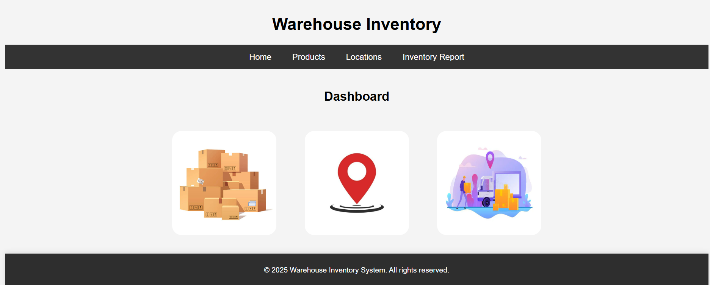
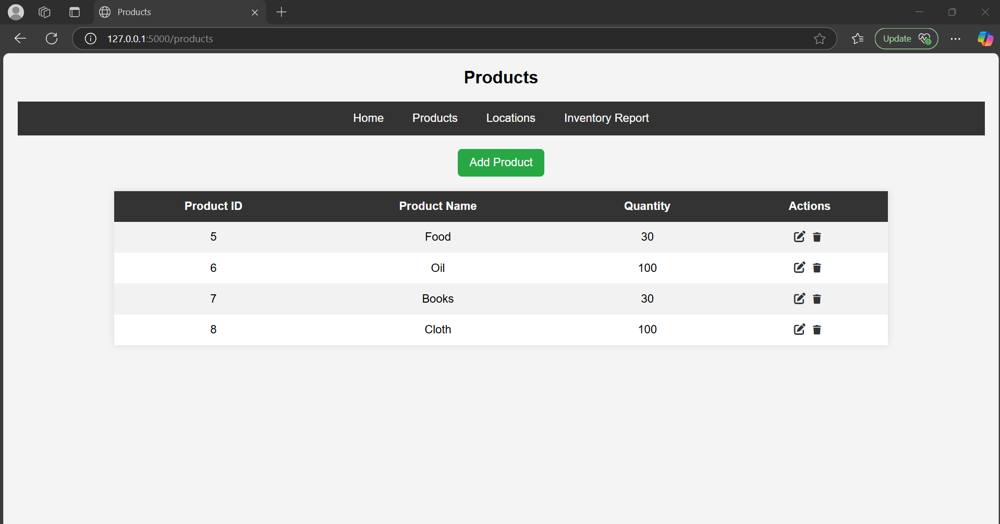
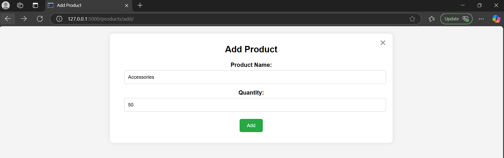
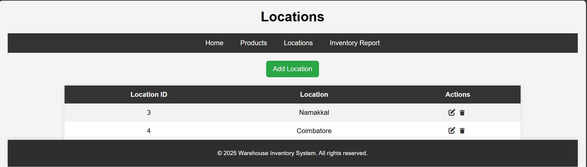
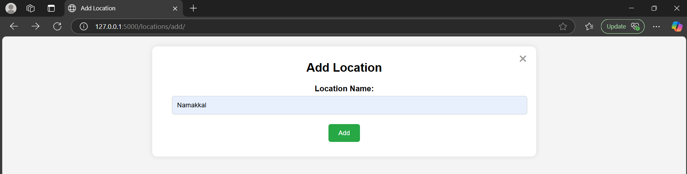
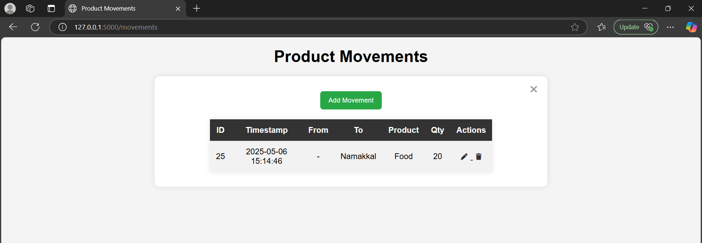
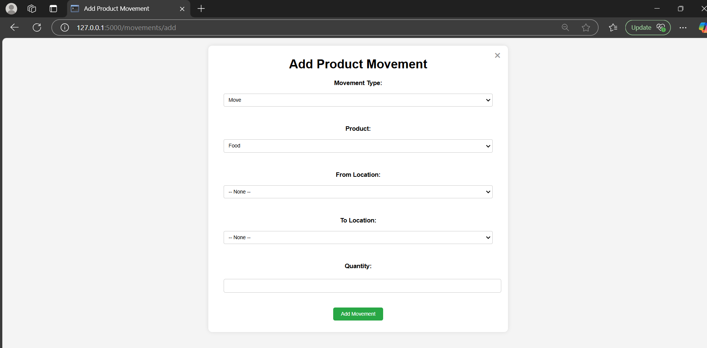
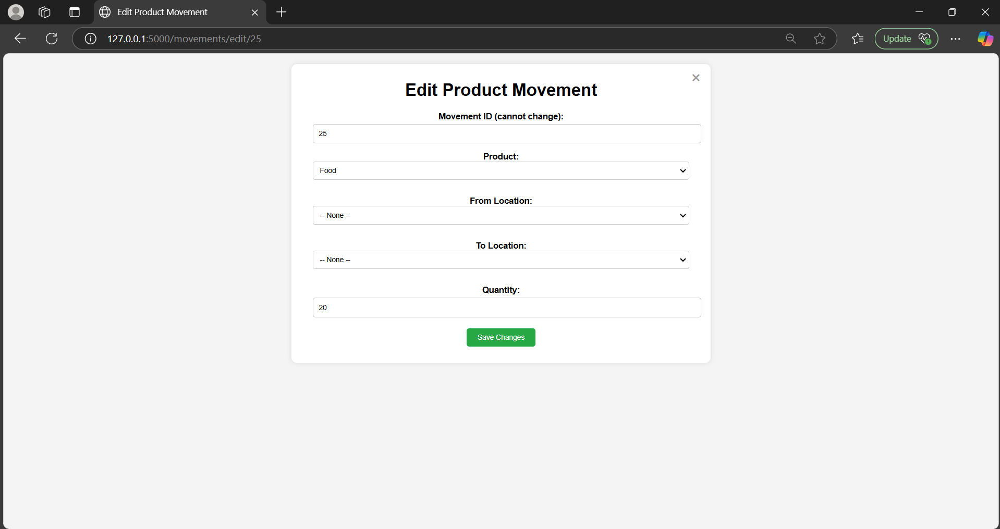
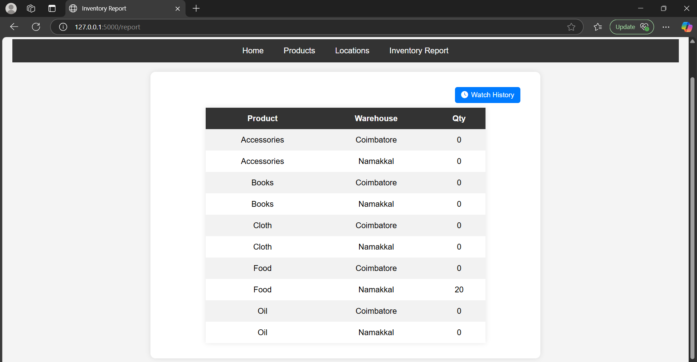

# Warehouse Inventory Management System

A web-based inventory management system built using **Flask** and **MySQL** that allows users to manage products, warehouse locations, stock movements, and generate inventory reports.

## Features

- Add, edit, delete products and locations.
- Track stock movement between locations.
- Real-time stock quantity updates.
- Prevent deletion or modification of used entities.
- Generate detailed inventory reports showing stock at each location.
- User-friendly interface with basic error and validation handling.

## Technologies Used

- Python (Flask Framework)
- MySQL (Relational Database)
- HTML/CSS (Basic Frontend Templates)
- Jinja2 Templating Engine

## Screenshots

### 🏠 Home Page

### 📦 Products Page
View, add, edit, and delete products.

### ➕ Add Product

### 🏭 Locations Page
View, add, edit, and delete warehouse locations.

### ➕ Add Location

### 🔁 Product Movements
Track product transfers between warehouse locations.

### ➕ Add Movement

### ✏️ Edit Movement

### 📊 Inventory Report
View live inventory at each warehouse.

